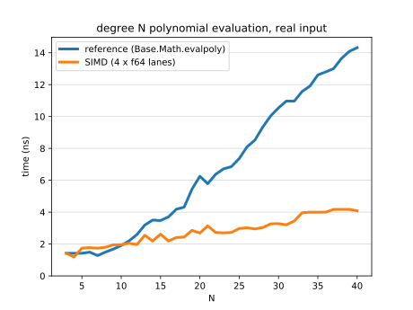
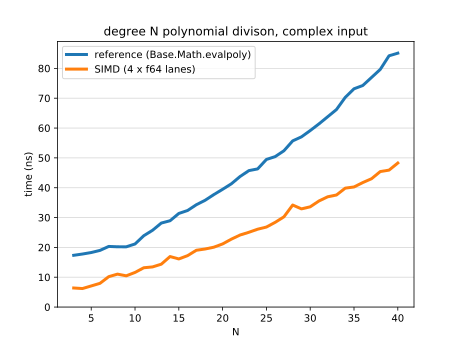

# SIMDPoly.jl

SIMD optimized polyomial evaluation for real and complex inputs. 

## Usage

The functions for packing and evaluating polynomials are suffixed
with `(N)x(L)[r|c]`:
- `N` is the number of polynomials to evaluate
- `L` is the number of SIMD lanes per polynomial
- `r` or `c` signifies that the polynomial will be evaluated
with a real or complex input, respectively.

For instance evaluating one polynomial with four SIMD lanes:

```julia
coeffs = ntuple(x -> Float64(x), 30) # p(x) = 1 + 2x^1 + ... + 30x^29
packed = packpoly1x4r(coeffs)        # pack coefficients into SIMD vectors
result = evalpoly1x4r(2.0, packed)   # evaluate p(2)
```

Complex polynomial division:
```julia
poly1 = ntuple(x -> Float64(x), 30)         # p(x) = 1 + 2x^1 + ... + 30x^29
poly2 = reverse(poly1)                      # q(x) = 30 + 29x^1 + ... + x^29
packed = packpoly2x2c(poly1, poly2)
result = evalpolydiv2x2c(2.0+2.0im, packed) # p(2+2i) / q(2+2i)
```

## Benchmarks

Note: these only measure evaluation time; the packed coefficients have been precomputed.




